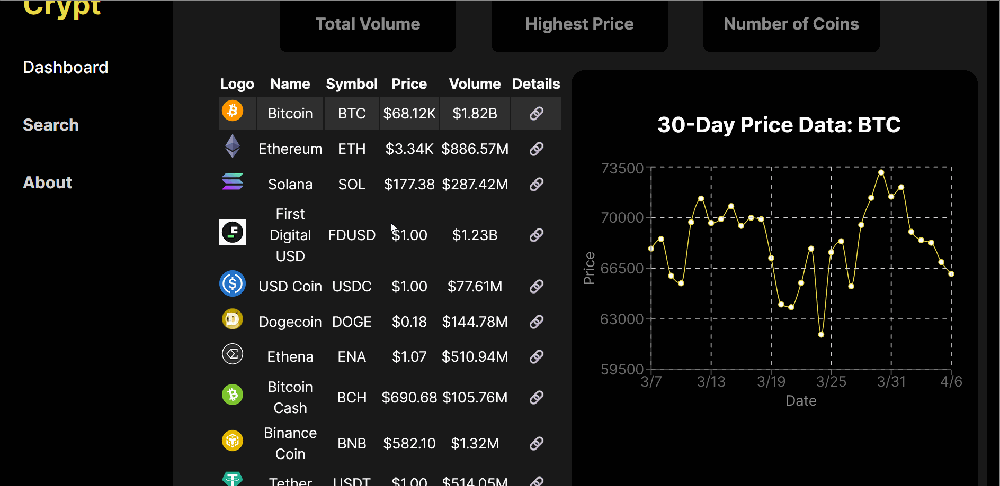

# Web Development Project 6 - _Crypt Dash Board_

Submitted by: **Isaac Shaker**

This web app: **iDisplays the top 10 crypto coins for the day by volume traded and their monthly graph**

Time spent: **4** hours spent in total

## Required Features

The following **required** functionality is completed:

- [x] **The app includes at least one unique chart developed using the fetched data that tell an interesting story**
- [x] **Clicking on an item in the list view displays more details about it**
- [x] **Clicking on an item has a direct, unique link to that item's detail view page**

The following **optional** features are implemented:

- [ ] The site's customized dashboard contains more content that explains what is interesting about the data
- [x] The site allows users to toggle between different data visualizations

The following **additional** features are implemented:

- [ ] List anything else that you added to improve the site's functionality!

## Video Walkthrough

Here's a walkthrough of implemented user stories:

GIF created with LICEcap

## Notes

I had trouble changing the graph when a row was clicked. This was becasue the table row (tr) that I was trying to trigger was a double nested component, which made it tricky to change the state of the App component. I passed the setter function from useState as props and that solved the issue.

## License

    Copyright 2024 Isaac Shaker

    Licensed under the Apache License, Version 2.0 (the "License");
    you may not use this file except in compliance with the License.
    You may obtain a copy of the License at

        http://www.apache.org/licenses/LICENSE-2.0

    Unless required by applicable law or agreed to in writing, software
    distributed under the License is distributed on an "AS IS" BASIS,
    WITHOUT WARRANTIES OR CONDITIONS OF ANY KIND, either express or implied.
    See the License for the specific language governing permissions and
    limitations under the License.
