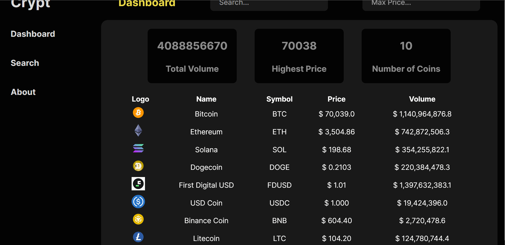

# Web Development Project 5 - Crypt Dash Board

Submitted by: **Isaac Shaker**

This web app: **Displays the top 10 crypto coins for the day by volume traded.**

Time spent: **3** hours spent in total

## Required Features

The following **required** functionality is completed:

- [x] **The list displays a list of data fetched using an API call**
- [x] **Data uses the useEffect React hook and async/await syntax**
- [x] **The app dashboard includes at least three summary statistics about the data such as**
  - [x] _Total Volue Tradded, Highest Price, Number of Coins_
- [x] **A search bar allows the user to search for an item in the fetched data**
- [ ] **Multiple different filters (2+) allow the user to filter items in the database by specified categories**

The following **optional** features are implemented:

- [ ] Multiple filters can be applied simultaneously
- [ ] Filters use different input types such as a text input, a selection, or a slider
- [ ] The user can enter specific bounds for filter values

The following **additional** features are implemented:

- [ ] List anything else that you added to improve the site's functionality!

## Video Walkthrough

Here's a walkthrough of implemented user stories:

GIF created with LICEcap

## Notes

I had a difficult time getting the side Nav to be in place. When using a fized position, the rest of the application treated the nav as a ghost and would go underneath it.
The problem was solved by treating the nav like any other component and using flex box with flow-direction row. I am over simplifing the solution for the sake of discussion. Many problems came up when trying to keep the nav a fixed size and without scrolling effecting it.

<!---------------------------------------------------------------------------------------------------------------------------------------------------------------------------------->

# Web Development Project 6 - _Crypt Dash Board_

Submitted by: **Isaac Shaker**

This web app: **iDisplays the top 10 crypto coins for the day by volume traded and their monthly graph**

Time spent: **X** hours spent in total

## Required Features

The following **required** functionality is completed:

- [ ] **The app includes at least one unique chart developed using the fetched data that tell an interesting story**
- [ ] **Clicking on an item in the list view displays more details about it**
- [ ] **Clicking on an item has a direct, unique link to that item's detail view page**

The following **optional** features are implemented:

- [ ] The site's customized dashboard contains more content that explains what is interesting about the data
- [ ] The site allows users to toggle between different data visualizations

The following **additional** features are implemented:

- [ ] List anything else that you added to improve the site's functionality!

## Video Walkthrough

Here's a walkthrough of implemented user stories:

GIF created with LICEcap

## Notes

Describe any challenges encountered while building the app.

## License

    Copyright 2024 Isaac Shaker

    Licensed under the Apache License, Version 2.0 (the "License");
    you may not use this file except in compliance with the License.
    You may obtain a copy of the License at

        http://www.apache.org/licenses/LICENSE-2.0

    Unless required by applicable law or agreed to in writing, software
    distributed under the License is distributed on an "AS IS" BASIS,
    WITHOUT WARRANTIES OR CONDITIONS OF ANY KIND, either express or implied.
    See the License for the specific language governing permissions and
    limitations under the License.
